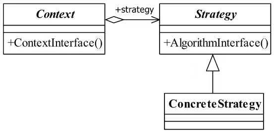

# 面向对象设计的五大原则
### 单一职责原则（Single Responsibility Principle  SRP）
>就一个类而言，应该只有一个引起它变化的原因。
单一职责有两个含义：一个是避免相同的职责分散到不同的类中，另一个是避免一个类承担太多职责。
为什么要遵守SRP?
（1）减少类之间的耦合：当需求变化时，只修改一个累，从而也就隔离了变化
（2）提高类的复用性

### 接口隔离原则（Interface Segregation Principle ISP）
>表明客户端不应该被强迫实现他们不会使用的接口，应该把胖接口中的方法分组，然后用多个接口代替它，每个接口服务于一个字模块。使用多个专用的接口比使用单个接口要好得多。
 ISP主要观点：1）一个类对另外一个类的依赖性应当时建立在最小的接口上的。接口的实现类应该只呈现为单一指责的角色，降低客户之间的相互影响
 2）客户端程序不应该依赖它不需要的接口方法
 ### 开放-封闭原则（OpenClosePrinciple）
 >Open(Open for extension)模块的行为必须事开放的，支持扩展的，不僵化的。
  Closed（Closed for modification）对模块的功能进行扩展时，不应该影响或大规模地影响已有的程序模块
  如何遵守开放-封闭原则
  1）在设计方面充分应用“抽象”和“封装”的思想：在软件系统中找出各种可能的“可变因素”并封装起来；另一方面，一种可变性因素不应当散落在多个不同代码模块中，而应当被封装到一个对象中。
  2）在系统功能编程实现方面应用面向接口的编程
 ###替换原则（里氏替换原则 Liskov Substitution Principle LSP）
 >子类型必须能够替换掉他们的父类型，并出现在父类能够出现的任何地方
 ### 依赖倒置原则(Dependence Inversion Principle)
 >上层模块不应该依赖于下层模块，它们共同依赖于一个抽象。
 
 
 
# 设计模式
### [工厂模式 （factory）](https://github.com/bugooo/Design-Pattern/blob/master/Factory.php)
>允许你在代码执行时实例化对象。它之所以被称为工厂模式是因为它负责“生产”对象。以数据库为例，工厂需要的就是根据不同的参数，生成不同的实例化对象。最简单的工厂就是根据传入的类型名实例化对象.
 
### 策略模式 (Strategy Pattern) / 政策模式（Policy Pattern）
 >定义一组算法，将每个算法都封装起来，并且使它们之间可以互换。策略模式使用的就是面向对象的继承和多态机制。                                   
 
 #####三种角色
* Context 封装角色
> 也叫做上下文角色，起承上启下封装作用，屏蔽高层模块对策略、算法的直接访问，封装可能存在的变化。

php代码示例
```
class Context{
    //抽象策略
    private $_strategy = null;
    public function __construct($strategyObj){
        $this->_strategy = $strategyObj;
    }
    //封装后的策略方法
    public function doAnythinig(){
        $this->_strategy->doSomething();
    }
}

```
* Strategy抽象策略角色
> 策略、算法家族的抽象，通常为接口，定义每个策略或算法必须具有的方法和属性。

php代码示例
```
interface Strategy { 
    //策略模式的运算法则
    public function doSomething(); 
} 
```
* ConcreteStrategy具体策略角色
>实现抽象策略中的操作，该类含有具体的算法

php代码示例
```
class ConcreteStrategy1 implements Strategy{
      public function doSomething(){
            echo "具体策略1的运算法则";
      }
}
class ConcreteStrategy2 implements Strategy{
      public function doSomething(){
            echo "具体策略2的运算法则";
      }
}
```
高层模块调用代码示例
```
class Client{
    static public function main(){
        //声明一个具体的策略
        $strategy = new ConcreteStrategy1();
        //声明上下文对象
        $context = new Context($strategy);
        //执行封装后的方法
        $context->doAnythinig();
    }
}
```

##### 策略模式通用类图


##### 优点                                   
* 算法可以自由切换
* 避免使用多重条件判断
* 扩展性良好                                   

##### 缺点
* 策略类数量增多
* 所有的策略类都需要对外暴露

##### 使用场景
* 多个类只有在算法或行为上稍有不同的场景
* 算法需要自由切换的场景
* 需要屏蔽算法规则的场景

##### 注意事项
>  如果系统中的一个策略家族的具体策略数量超过4个，则需要考虑使用混合模式，解决策略类膨胀和对外暴露的问题。

